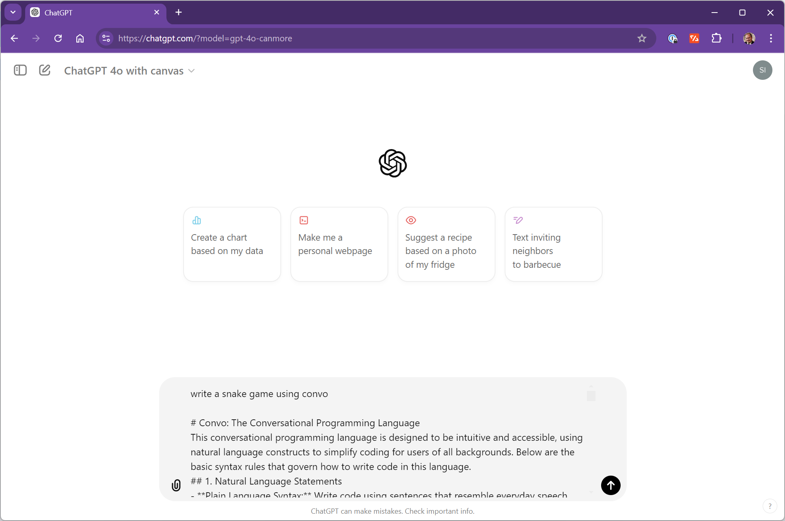
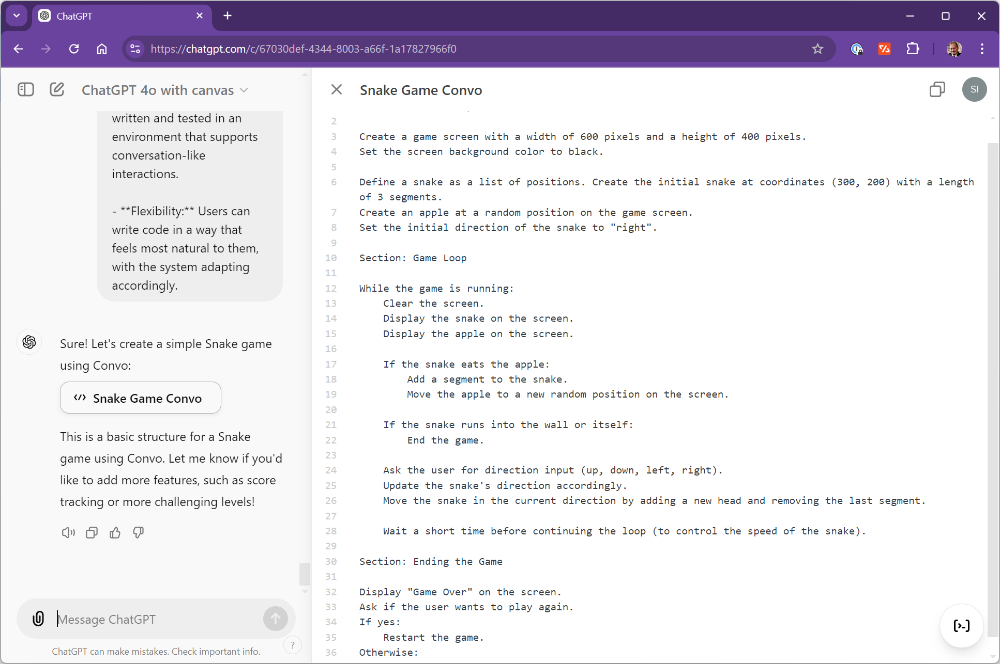
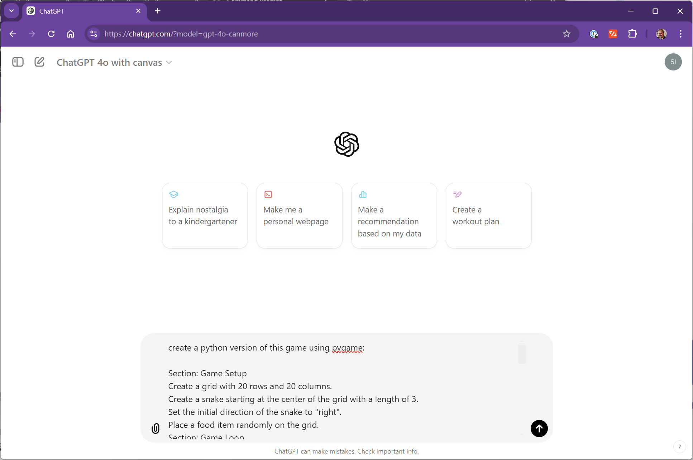
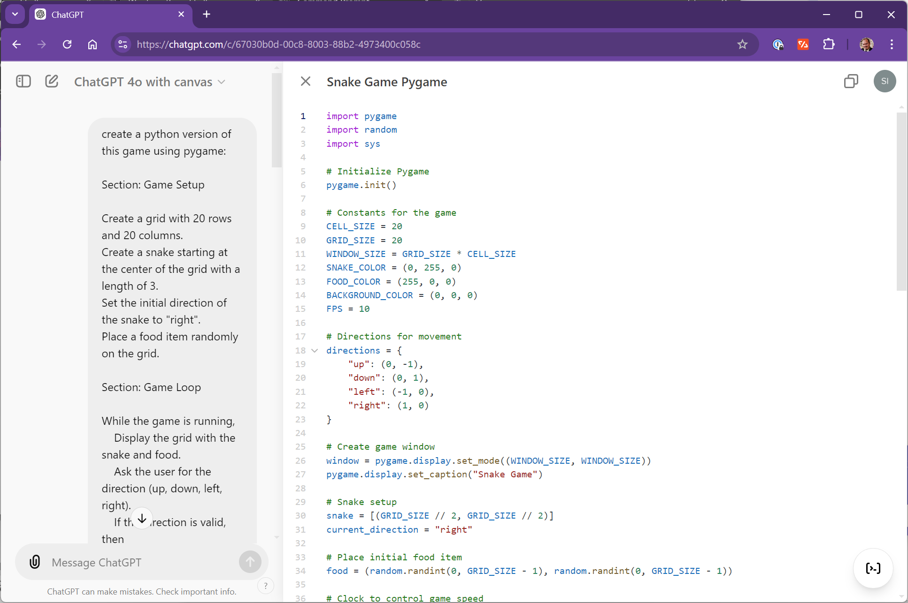

# Convo: a conversational programming language

Convo is a high-level, conversational programming language designed to be interpreted by Generative AI models. It allows developers to write code in plain, natural language, making programming more accessible and intuitive. You can think of Convo as high-level pseudocode that describes the "gist" of a program, which a Large Language Model (LLM) can then translate into specific programming languages like Python, JavaScript, or any other language.

The flow for creating a convo app is `english->convo->python`. Why is that better then the current flow of `english->python`? When you ask ChatGPT to "create a snake game using python" you can't predict what version of snake you're going to get back from the model. It will be a version of snake but you don't know what features it's going to have, how it will be styled, etc.  When you ask ChatGPT to "create a snake game using convo" you're also going to get back a version of snake with an unpredictable set of features, but it's written at a much higher level and using natural language. You can easily tweak the convo version of the app to have the features and styling you want and then once you get the convo program the way you want you can send it to the model to generate a python version of teh game. The returned output will be much cloaser to having all of the styling and features you specified in your convo program. 

## Table of Contents

1. [Key Features](#key-features)
2. [Snake Game Example](#snake-game-example)
3. [Advantages of Convo](#advantages-of-convo)
4. [Full Specification](#full-specification)
5. [Creating Convo Programs](#creating-convo-programs)
   - [Generating Convo Programs](#generating-convo-programs)
   - [Porting Convo Programs to other Languages](#porting-convo-programs-to-other-languages)

## Key Features

- **Natural Language Syntax**: Write code using everyday language, making it easy to read and understand.
- **Multilingual Support**: Write Convo programs in any language, not just English, allowing for global accessibility. [snake in Spanish](examples/snake-es.convo)
- **Implicit Variable Declaration**: Variables are created when first mentioned, reducing the need for explicit declarations.
- **Flexible Control Structures**: Use natural phrases like "If", "While", "For each" to control the flow of the program.
- **Functions and Procedures**: Define and call functions using plain language descriptions.
- **Object-Oriented Concepts**: Define classes and objects using descriptive language, enabling intuitive OOP features.
- **Error Tolerance**: Minor grammatical errors are tolerated, with the interpreter inferring the intended meaning.
- **Style and Resource Definitions**: Organize styles and resources in dedicated sections for better organization.

## Snake Game Example

Below is an example of how you might write a simple Snake game in Convo:

```plaintext
Section: Game Setup

Create a grid with 20 rows and 20 columns.
Create a snake starting at the center of the grid with a length of 3.
Set the initial direction of the snake to "right".
Place a food item randomly on the grid.

Section: Game Loop

While the game is running,
    Display the grid with the snake and food.
    Ask the user for the direction (up, down, left, right).
    If the direction is valid, then
        Update the snake's direction to the user's input.
    Move the snake in the current direction.
    If the snake eats the food, then
        Increase the snake's length by 1.
        Place a new food item randomly on the grid.
    If the snake collides with itself or the wall, then
        End the game and display "Game Over! Your score is [snake's length]."

Section: Functions

To display the grid with the snake and food,
    Clear the screen.
    For each cell in the grid,
        If the cell contains a part of the snake, then
            Display "S".
        Else if the cell contains food, then
            Display "F".
        Else
            Display ".".

To move the snake in the current direction,
    Calculate the new head position based on the current direction.
    Add the new head position to the snake.
    Remove the last part of the snake unless it has just eaten food.

To place a food item randomly on the grid,
    Choose a random empty cell on the grid.
    Place the food item in that cell.
```

### Explanation

1. **Game Setup:**
   - A grid is created to represent the game area, and a snake is initialized at the center with a length of 3.
   - The initial direction of the snake is set to "right", and a food item is placed randomly on the grid.

2. **Game Loop:**
   - The game runs in a loop, continuously displaying the grid and asking the user for input to change the snake's direction.
   - The snake moves in the current direction, and if it eats the food, its length increases, and a new food item is placed.
   - The game ends if the snake collides with itself or the wall, displaying a "Game Over" message with the score.

3. **Functions:**
   - `Display the grid with the snake and food`: This function clears the screen and displays the current state of the grid, showing the snake and food.
   - `Move the snake in the current direction`: This function updates the snake's position based on its current direction and handles the growth of the snake when it eats food.
   - `Place a food item randomly on the grid`: This function selects a random empty cell to place a new food item.

## Advantages of Convo

- **Write Once, Run Anywhere**: Write Convo programs in any natural language, and LLMs can interpret and generate code in various programming languages.
- **Future-Proof Code**: As LLMs improve over time, you can regenerate the underlying implementation code from your Convo programs without changing the original code.
- **Accessibility**: Lowers the barrier to programming by allowing people to use language they are comfortable with.
- **Leverage AI Improvements**: Benefit from advancements in AI to produce more efficient and sophisticated code over time.

## Full Specification

For a complete overview of Convo's syntax and features, refer to the [full Convo specification](convo-spec.md).

## Creating Convo Programs

You can easily create new convo programs using a tool like [ChatGPT](https://chatgpt.com/) or [Claude](https://claude.ai/).

### Generating Convo Programs

Generating a convo program is as simple as creating a prompt that describes the program you want and then appending the text of the [convo spec](convo-spec.md) to your prompt:





Once you've generated your base program definition you can tweak it and make changes either using generative AI or directly using natural language.

### Porting Convo Programs to other Languages

Convo programs can be easily ported to other languages like Python or JavaScript. Just create a prompt specifying the language to port the program to and then paste in the program.  The LLM will intuitively figure out the right code to generate using just the program definition so no spec is needed during this phase.  You can also express any style modifications or implementation details to use during this phase like specific libraries to use:





Save the ported app to your environment of choice to run it.  More advanced programs will likely require some debugging and you can use generative AI tools like Canvas to help with this debugging.
